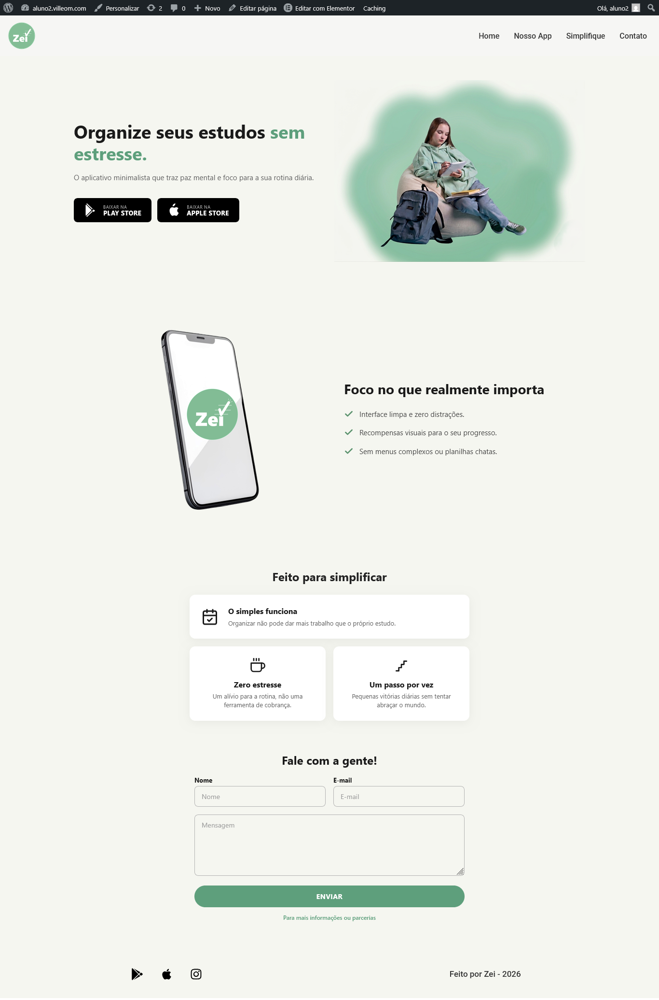

# 📚 Zei - Landing Page para App de Estudos

#### Bem-vindo(a) ao projeto Zei!
O **Zei** é uma landing page desenvolvida para apresentar um aplicativo focado na organização e produtividade dos estudos. Este projeto nasceu e foi planejado durante as aulas de **UI/UX Design**, unindo conceitos de experiência do usuário, prototipagem e desenvolvimento web front-end.

---

## 🌟 O que você vai encontrar no site:
* **Apresentação do App:** Visão geral das funcionalidades e da proposta de valor do Zei para estudantes.
* **Design Focado em UX/UI:** Interface intuitiva, limpa e moderna, pensada para oferecer a melhor navegação ao usuário.
* **Layout Responsivo:** Adaptado para proporcionar uma excelente experiência tanto em dispositivos móveis quanto em desktops.
* **Interatividade:** Elementos interativos desenvolvidos em JavaScript puro.

---

## 🚀 Acesse o projeto:
🔗 [Clique aqui para visualizar o site](https://ingridssilveira.github.io/Zei/)

---

## 🛠️ Tecnologias Utilizadas:

---

## 👩‍💻 Autora

* **Ingrid Souza** - *UI/UX Design & Front-End Developer*
  * [GitHub](https://github.com/IngridsSilveira)